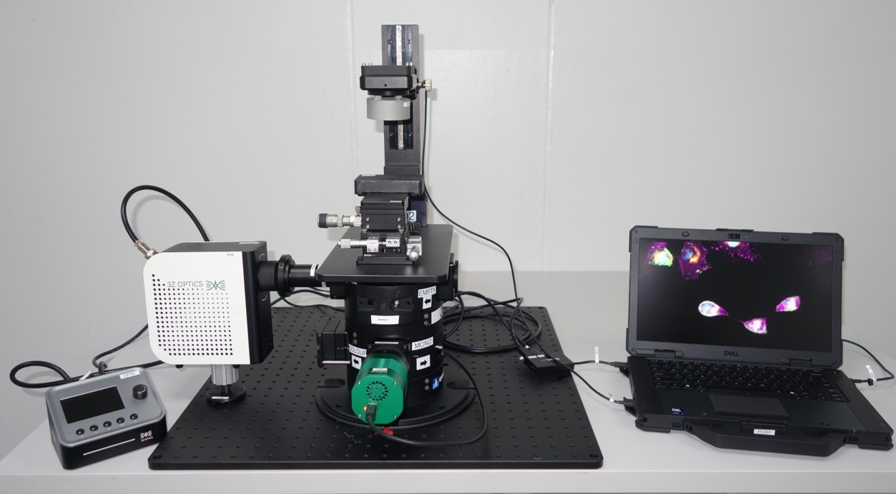

# openScopes Connect Africa (OSCA) Traveller

{ style="max-width: 75%;" }

*A modular, open-source digital microscopy platform for **brightfield** and **fluorescence** imaging—portable, field-ready, and designed for rapid setup in research environments.*

The openScope Traveller (or just the Traveller) is a modular, open-source digital microscopy platform designed to provide accessible, field-deployable imaging capabilities for research and teaching. It supports both **brightfield** and **fluorescence** imaging modalities, and can be configured for **advanced time-lapse acquisitions**. The Traveller has been engineered for portability, rapid setup, and reliable operation in both laboratory and field settings.

The Traveller is adapted from the openFrame microscope, a modular and cost-effective platform developed around open-hardware principles. At its core, the openFrame architecture uses stackable cylindrical aluminum layers aligned along a central optical axis. This modular design provides a flexible framework that can accommodate both standard and specialised microscope components. The architecture also makes it straightforward to interface with external optical cage assemblies, offering users an extended range of experimental configurations.

By maintaining compatibility with open-source software tools such as Micro-Manager and ImageJ/Fiji, openFrame-based microscopes remain easy to maintain, simple to upgrade, and adaptable to most light microscopy techniques. This ensures that Traveller users benefit from both hardware modularity and software flexibility.

**See the following pages for more information on the openScopes ecosystem:**

- **GitHub**
    [openScope Traveller GitHub](https://github.com/frasermo/OSCA){:target="_blank"}

- **YouTube**
    [openScope Traveller YouTube channel](https://youtu.be/Y0lEH0RwTDU){:target="_blank"}

- **GitHub Pages**
    [openScope Traveller GitHub Pages](https://frasermo.github.io/OSCA){:target="_blank"}

- **openFrame**
     [openFrame GitHub](https://github.com/ImperialCollegeLondon/openFrame){:target="_blank"}

**Compliance & Purpose**
- IEEE 1063 Software User Documentation
- ISO/IEC 82079‑1 Instructions for use
- ISO/IEC 26514 Documentation for end users

**Intended audience:** microscopy specialists, technical staff, researchers.

**Key features**
- Portable (fits two Pelican cases)
- Modular optical/illumination design (filter cubes, stackable layers)
- Preconfigured software (Micro‑Manager) for fast startup
- Brightfield & fluorescence imaging; time‑lapse capable

Start with [[Quickstart →|getting-started/QUICKSTART]].
